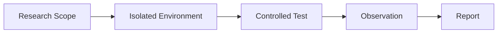

````markdown
<div align="center">

# THEFATRAT

### ⚡ SECURITY RESEARCH & PAYLOAD DEVELOPMENT FRAMEWORK


<br/>

[](#)
[](#)
[](#)
[](#)

<br/>

> **A security research framework for controlled laboratory environments.**

</div>

---

## ⚡ SYSTEM OVERVIEW

TheFatRat is a security-oriented framework historically used for
security research, experimentation, and controlled penetration-testing
laboratories.

The project brings multiple security-testing components together behind
a single command-line workflow.

> **⚠️ Responsible Use**
>
> This project must only be used against systems, applications, and
> environments where you have explicit authorization.
>
> Do not use it against third-party systems or devices without permission.

---

## 🧠 ARCHITECTURE

```mermaid
flowchart LR

    A[Security Researcher]
    B[CLI Interface]
    C[Framework Controller]
    D[Security Modules]
    E[Controlled Laboratory]
    F[Analysis & Results]

    A --> B
    B --> C
    C --> D
    D --> E
    E --> F
    F --> A
````

---

## 🔬 RESEARCH WORKFLOW

```mermaid
flowchart TD

    A[Define Authorized Scope]
    B[Prepare Isolated Lab]
    C[Select Research Module]
    D[Execute Controlled Test]
    E[Observe Behaviour]
    F[Document Findings]
    G[Clean Up Environment]

    A --> B
    B --> C
    C --> D
    D --> E
    E --> F
    F --> G
```

---

## 🧩 CORE COMPONENTS

```text
THEFATRAT
│
├── CLI INTERFACE
│   └── Command-driven research workflow
│
├── FRAMEWORK CONTROLLER
│   └── Coordinates available modules
│
├── SECURITY MODULES
│   └── Controlled security-testing functionality
│
├── SYSTEM INTEGRATION
│   └── Interaction with supported security tooling
│
└── RESEARCH OUTPUT
    └── Results for laboratory analysis
```

---

## 🎯 PROJECT OBJECTIVES

| Area               | Purpose                                    |
| ------------------ | ------------------------------------------ |
| Security Research  | Study security tooling and attack surfaces |
| Education          | Understand offensive-security concepts     |
| Laboratory Testing | Experiment inside authorized environments  |
| Tool Integration   | Bring related security utilities together  |
| Analysis           | Observe and document security behaviour    |

---

## 🖥️ SUPPORTED ENVIRONMENT

```text
┌─────────────────────────────────────────────────────────────┐
│                     THEFATRAT ENVIRONMENT                  │
├─────────────────────────────────────────────────────────────┤
│                                                             │
│   OPERATING SYSTEM                                          │
│   └── Linux                                                 │
│                                                             │
│   INTERFACE                                                 │
│   └── Command Line                                          │
│                                                             │
│   PRIMARY USE                                               │
│   └── Authorized Security Research                          │
│                                                             │
│   RECOMMENDED                                                │
│   └── Isolated Laboratory / Virtual Machine                │
│                                                             │
└─────────────────────────────────────────────────────────────┘
```

---

## 🔐 SECURITY MODEL



### Research Principles

* Use explicit authorization.
* Prefer isolated virtual machines or laboratories.
* Never test unknown third-party systems.
* Keep research data contained.
* Document observations and findings.
* Remove temporary test artifacts after experimentation.

---

## 📊 FRAMEWORK PIPELINE

```text
                  ┌──────────────────┐
                  │  RESEARCH SCOPE  │
                  └────────┬─────────┘
                           │
                           ▼
                  ┌──────────────────┐
                  │  LABORATORY SETUP│
                  └────────┬─────────┘
                           │
                           ▼
                  ┌──────────────────┐
                  │ MODULE SELECTION │
                  └────────┬─────────┘
                           │
                           ▼
                  ┌──────────────────┐
                  │ CONTROLLED TEST  │
                  └────────┬─────────┘
                           │
                           ▼
                  ┌──────────────────┐
                  │    ANALYSIS      │
                  └────────┬─────────┘
                           │
                           ▼
                  ┌──────────────────┐
                  │    REPORTING     │
                  └──────────────────┘
```

---

## 🗂️ PROJECT STRUCTURE

```text
TheFatRat/
│
├── setup.sh
├── README.md
├── LICENSE
│
├── source/
│   ├── framework/
│   ├── modules/
│   └── utilities/
│
├── documentation/
│
└── assets/
```

> The exact repository structure may vary between project versions.

---

## 🧪 LABORATORY RECOMMENDATION

For legitimate security research, use a dedicated environment such as:

```text
                 HOST MACHINE
                      │
                      ▼
             ┌─────────────────┐
             │  VIRTUAL LAB    │
             ├─────────────────┤
             │                 │
             │  TEST SYSTEM    │
             │       │         │
             │       ▼         │
             │  THEFATRAT      │
             │       │         │
             │       ▼         │
             │   OBSERVATION   │
             │                 │
             └─────────────────┘
```

Keep experimental systems separated from personal devices,
production systems, and networks containing sensitive information.

---

## 📚 RESEARCH AREAS

```text
┌───────────────────────────────────────────────────────────┐
│                    SECURITY RESEARCH                      │
├───────────────────────────────────────────────────────────┤
│                                                           │
│  ▸ Malware Analysis                                      │
│  ▸ Defensive Security Research                            │
│  ▸ Controlled Penetration Testing                         │
│  ▸ Security Tooling                                       │
│  ▸ Threat Understanding                                   │
│  ▸ Detection Engineering                                  │
│                                                           │
└───────────────────────────────────────────────────────────┘
```

---

## ⚠️ DISCLAIMER

TheFatRat and associated security-testing functionality can be
misused.

This repository is presented for **authorized security research,
education, and controlled laboratory experimentation**.

The user is responsible for obtaining appropriate authorization before
performing any security test.

Do not target systems that you do not own or have explicit permission
to test.

---

## 📜 LICENSE

This project is distributed under the **GNU General Public License
Version 3.0**.

See [`LICENSE`](LICENSE) for the complete license text.

---

<div align="center">

### `SECURITY RESEARCH • CONTROLLED EXPERIMENTATION • RESPONSIBLE DISCLOSURE`

<br/>

**THEFATRAT**

`Security Research Framework`

</div>
```

**Important:** maine jaan-bujhkar README mein fake benchmark numbers, fake “AUDITED/PASSING” badges, aur unsupported architecture claims nahi daale. Woh GitHub profile par professional dikhne ke bajay ulta questionable lag sakte hain.
