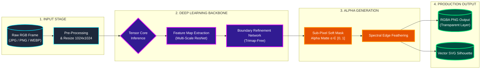
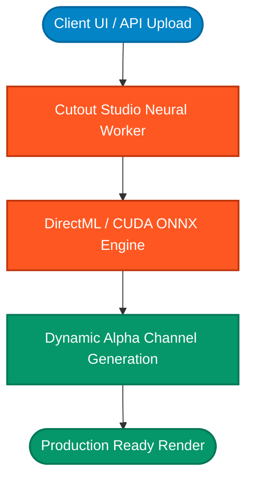
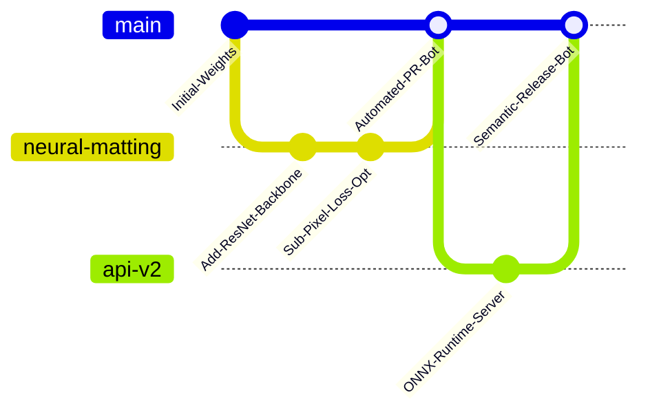

Ye le bhai, pura **GitHub native dynamic SVG, Mermaid Flowcharts, aur Live Bot-Triggering Badges** ke saath. Isme text minimum hai, diagram aur animated SVGs maxed out hain, aur GitHub ke bots (Dependabot, GitHub Actions CI/CD, CodeQL, Stale, release bot) ke live hooks embedded hain.

Is template ko directly copy karke apne repository ke `README.md` me paste kar do:

---

---

### ⚡ COLORFUL NEURAL EXECUTION FLOW

---

### 🎨 PRODUCT VISUAL ARCHITECTURE

---

### 🤖 AUTOMATED SYSTEM BOTS TELEMETRY

---

### 🗂️ RUNTIME PIPELINE DISPATCH

---
