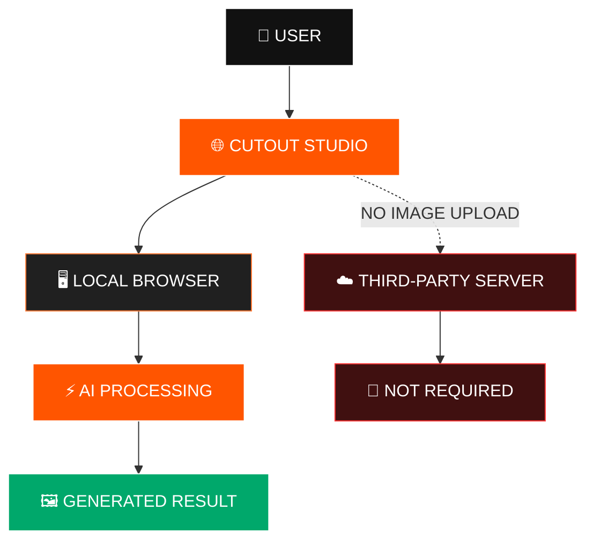
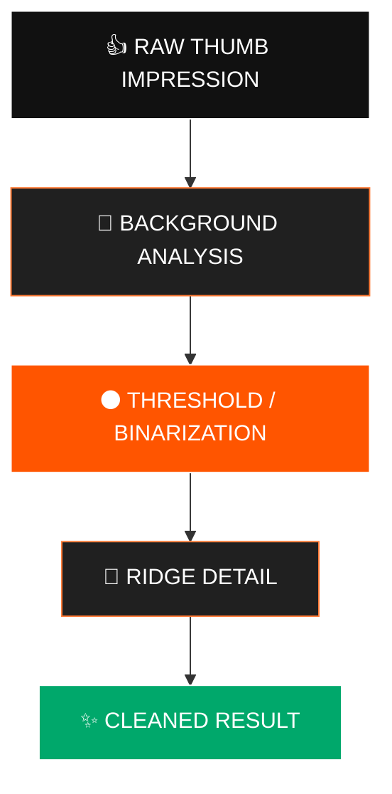
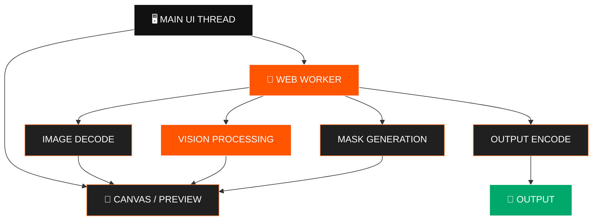
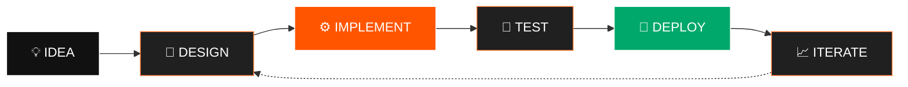

````markdown
# ✂️ CUTOUT Studio

<div align="center">


### `ONEPERSONAI / COMPUTER VISION / CLIENT-SIDE AI`


<br/>

[](https://cutout.onepersonai.in/)
[](https://github.com/AkshatRaj00/cutout-studio)
[](LICENSE)
[](https://nextjs.org/)

<br/><br/>

**Turn ordinary images into production-ready transparent assets — directly inside the browser.**

</div>

---

# 🧬 What is CUTOUT Studio?

**CUTOUT Studio** is a privacy-first browser-based image processing platform built by **Akshat Raj / OnePersonAI**.

Instead of sending every image to a remote image-processing service, CUTOUT Studio is designed around a **client-side execution model** where image processing happens inside the user's browser.

That makes it especially useful for workflows involving:

- 🪪 Government / competitive-exam photographs
- 👍 Left Thumb Impressions
- ✍️ Signatures
- 🎨 Creator assets
- 🖼️ Transparent PNG cutouts
- 📸 High-resolution image preparation

---

# ⚡ THE CORE IDEA

```text
                     ┌─────────────────────────────┐
                     │        USER IMAGE            │
                     │     JPG / PNG / WEBP         │
                     └──────────────┬──────────────┘
                                    │
                                    ▼
                     ┌─────────────────────────────┐
                     │       CUTOUT STUDIO          │
                     │        BROWSER ENGINE        │
                     └──────────────┬──────────────┘
                                    │
                ┌───────────────────┼───────────────────┐
                │                   │                   │
                ▼                   ▼                   ▼
        ┌──────────────┐    ┌──────────────┐    ┌──────────────┐
        │ BACKGROUND   │    │  BIOMETRIC   │    │   CREATOR    │
        │   REMOVAL    │    │  PROCESSING  │    │   WORKFLOW   │
        └──────┬───────┘    └──────┬───────┘    └──────┬───────┘
               │                   │                   │
               └───────────────────┼───────────────────┘
                                   ▼
                     ┌─────────────────────────────┐
                     │       LOCAL PROCESSING       │
                     │       NO IMAGE UPLOAD        │
                     └──────────────┬──────────────┘
                                    │
                                    ▼
                     ┌─────────────────────────────┐
                     │      FINAL IMAGE OUTPUT      │
                     │ PNG / JPEG / TRANSPARENT     │
                     └─────────────────────────────┘
````

---

# 🧠 VISUAL SYSTEM ARCHITECTURE

```mermaid
flowchart LR

    A["📸 INPUT IMAGE"] --> B["🧹 PREPROCESSING"]

    B --> C["⚡ BROWSER ENGINE"]

    subgraph LOCAL["🖥️ USER DEVICE — LOCAL EXECUTION"]
        C --> D["🧵 WEB WORKER"]
        D --> E["🧠 AI / VISION MODEL"]
        E --> F["🎯 MASK / ALPHA"]
        F --> G["✨ EDGE REFINEMENT"]
        G --> H["📐 FRAMING & COMPRESSION"]
    end

    H --> I["💾 FINAL OUTPUT"]

    style A fill:#111111,stroke:#ff5500,stroke-width:3px,color:#ffffff
    style B fill:#171717,stroke:#ff7a35,stroke-width:2px,color:#ffffff
    style C fill:#ff5500,stroke:#ffffff,stroke-width:3px,color:#ffffff
    style D fill:#202020,stroke:#ff5500,stroke-width:2px,color:#ffffff
    style E fill:#ff5500,stroke:#ffffff,stroke-width:3px,color:#ffffff
    style F fill:#202020,stroke:#ff7a35,stroke-width:2px,color:#ffffff
    style G fill:#ff5500,stroke:#ffffff,stroke-width:2px,color:#ffffff
    style H fill:#202020,stroke:#ff7a35,stroke-width:2px,color:#ffffff
    style I fill:#111111,stroke:#00d084,stroke-width:3px,color:#ffffff
```



---

# 🔥 WHY CLIENT-SIDE?



### Privacy-first design

```text
IMAGE
  │
  ▼
┌─────────────────────────────────────────────┐
│              USER'S BROWSER                 │
│                                             │
│  Decode → Process → Segment → Refine → Save │
│                                             │
└─────────────────────────────────────────────┘
  │
  ▼
LOCAL RESULT

No mandatory image-processing round trip.
```

---

# 🎯 ONE ENGINE — MULTIPLE WORKFLOWS

```mermaid
flowchart TD

    A["✂️ CUTOUT STUDIO"] --> B["🎨 CREATOR MODE"]
    A --> C["🪪 EXAM PHOTO MODE"]
    A --> D["👍 LTI MODE"]
    A --> E["✍️ SIGNATURE MODE"]

    B --> B1["Transparent PNG"]
    B --> B2["High Resolution"]
    B --> B3["Edge Preservation"]

    C --> C1["Auto Framing"]
    C --> C2["Dimension Control"]
    C --> C3["File Size Optimization"]

    D --> D1["Background Cleanup"]
    D --> D2["Contrast Enhancement"]
    D --> D3["Ridge Preservation"]

    E --> E1["Ink Isolation"]
    E --> E2["Background Cleanup"]
    E --> E3["Transparent Output"]

    style A fill:#ff5500,stroke:#ffffff,stroke-width:3px,color:#ffffff

    style B fill:#202020,stroke:#ff7a35,color:#ffffff
    style C fill:#202020,stroke:#ff7a35,color:#ffffff
    style D fill:#202020,stroke:#ff7a35,color:#ffffff
    style E fill:#202020,stroke:#ff7a35,color:#ffffff

    style B1 fill:#111111,stroke:#ff5500,color:#ffffff
    style B2 fill:#111111,stroke:#ff5500,color:#ffffff
    style B3 fill:#111111,stroke:#ff5500,color:#ffffff

    style C1 fill:#111111,stroke:#ff5500,color:#ffffff
    style C2 fill:#111111,stroke:#ff5500,color:#ffffff
    style C3 fill:#111111,stroke:#ff5500,color:#ffffff

    style D1 fill:#111111,stroke:#ff5500,color:#ffffff
    style D2 fill:#111111,stroke:#ff5500,color:#ffffff
    style D3 fill:#111111,stroke:#ff5500,color:#ffffff

    style E1 fill:#111111,stroke:#ff5500,color:#ffffff
    style E2 fill:#111111,stroke:#ff5500,color:#ffffff
    style E3 fill:#111111,stroke:#ff5500,color:#ffffff
```



---

# 🧪 IMAGE PROCESSING PIPELINE


---

# 🎨 EDGE QUALITY

Background removal is not only about detecting the subject.

The final visual quality depends heavily on what happens around:

```text
                 SUBJECT
                    │
       ┌────────────┼────────────┐
       │            │            │
       ▼            ▼            ▼
     HAIR        CLOTHING      OBJECT EDGES
       │            │            │
       └────────────┼────────────┘
                    ▼
             ALPHA REFINEMENT
                    │
                    ▼
             CLEAN CUTOUT
```

The processing pipeline is designed to preserve useful boundary information while producing a clean transparent result.

---

# 🪪 EXAM IMAGE WORKFLOW


### Designed for workflows where dimensions and file size matter.

Examples include:

* UPSC
* SSC
* IBPS
* NEET
* Other online application workflows

> Always verify the current requirements of the specific portal before submitting an image.

---

# 👍 LEFT THUMB IMPRESSION



---

# ✍️ SIGNATURE PROCESSING

```text
          ORIGINAL
             │
             ▼
      ┌──────────────┐
      │ BACKGROUND   │
      │   ANALYSIS   │
      └──────┬───────┘
             │
             ▼
      ┌──────────────┐
      │ INK / CONTRAST│
      │   ISOLATION  │
      └──────┬───────┘
             │
             ▼
      ┌──────────────┐
      │ TRANSPARENT  │
      │    OUTPUT    │
      └──────────────┘
```

---

# ⚙️ PERFORMANCE ARCHITECTURE



### Why Workers?

Heavy image computation can interfere with UI responsiveness.

CUTOUT Studio separates processing work from the primary interface where practical, allowing the application to remain responsive while image operations run.

---

# 🧰 TECHNOLOGY STACK

```text
┌──────────────────────────────────────────────────────────┐
│                    CUTOUT STUDIO                         │
├──────────────────────────────────────────────────────────┤
│                                                          │
│  FRONTEND                                                │
│  ├── Next.js                                             │
│  ├── React                                               │
│  ├── TypeScript                                          │
│  └── Tailwind CSS                                        │
│                                                          │
│  COMPUTER VISION                                         │
│  ├── Transformers.js                                     │
│  ├── Background Removal Engine                           │
│  ├── Canvas Processing                                   │
│  └── Image Segmentation                                  │
│                                                          │
│  PERFORMANCE                                              │
│  ├── Web Workers                                         │
│  ├── OffscreenCanvas                                     │
│  └── Browser-side computation                            │
│                                                          │
│  PRODUCT INFRASTRUCTURE                                  │
│  ├── Next.js App Router                                  │
│  ├── Metadata / SEO                                      │
│  └── Schema.org structured data                          │
│                                                          │
└──────────────────────────────────────────────────────────┘
```

---

# 🗂️ PROJECT STRUCTURE

```text
cutout-studio/
│
├── app/
│   ├── layout.tsx
│   ├── page.tsx
│   ├── lti/
│   └── signature/
│
├── public/
│   └── workers/
│
├── lib/
│
├── components/
│
├── package.json
├── next.config.mjs
├── tsconfig.json
├── tailwind.config.*
└── README.md
```

---

# 🔥 FEATURE MATRIX

| Capability                     | CUTOUT Studio |
| :----------------------------- | :-----------: |
| Client-side processing         |       ✅       |
| Browser-based workflow         |       ✅       |
| Background removal             |       ✅       |
| Transparent PNG workflow       |       ✅       |
| High-resolution image workflow |       ✅       |
| Exam photo preparation         |       ✅       |
| LTI processing workflow        |       ✅       |
| Signature processing           |       ✅       |
| Web Worker architecture        |       ✅       |
| Modern Next.js application     |       ✅       |
| TypeScript                     |       ✅       |
| Tailwind CSS                   |       ✅       |

---

# 🆚 THE DIFFERENCE

```text
TRADITIONAL CLOUD WORKFLOW

IMAGE
  │
  ▼
UPLOAD
  │
  ▼
REMOTE SERVER
  │
  ▼
PROCESSING
  │
  ▼
DOWNLOAD
  │
  ▼
RESULT


CUTOUT STUDIO MODEL

IMAGE
  │
  ▼
BROWSER
  │
  ├── AI / VISION
  ├── PROCESSING
  ├── REFINEMENT
  └── EXPORT
  │
  ▼
RESULT
```

---

# 🚀 RUN LOCALLY

```bash
git clone https://github.com/AkshatRaj00/cutout-studio.git

cd cutout-studio

npm install

npm run dev
```

Open:

```text
http://localhost:3000
```

---

# 🧭 DEVELOPMENT FLOW



---

# 🌐 LIVE

<div align="center">

## Try CUTOUT Studio

<a href="https://cutout.onepersonai.in/">


</a>

<br/><br/>

**Upload → Process → Refine → Export**

**Without turning a simple image-editing task into a cloud-storage problem.**

</div>

---

# 👨‍💻 BUILT BY

<div align="center">


**Founder & Engineer — OnePersonAI**

Computer Vision • AI Engineering • Privacy-First Web Applications

</div>

---

# 📜 LICENSE

This project is released under the **MIT License**.

See [`LICENSE`](LICENSE) for details.

---

<div align="center">

### `CUTOUT STUDIO`

**Privacy-first image processing.
Built in the browser.
Designed for real workflows.**

<br/>

`ONEPERSONAI © AKSHAT RAJ`

</div>
```
