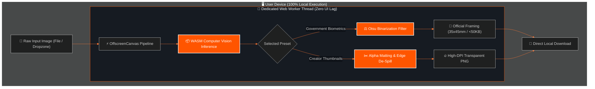

```markdown
<div align="center">

<!-- HERO BANNER -->


<br/>

<!-- ANIMATED TYPING SUBHEADING -->
<a href="https://cutout.onepersonai.in/">
  
</a>

<p align="center">
  <b>The next-generation, privacy-first computer vision studio engineered for creators, students, and engineers.</b>
</p>

<!-- ACTION PILLS & BADGES -->
<p align="center">
  <a href="https://cutout.onepersonai.in/">
    
  </a>
  <a href="https://github.com/AkshatRaj00/cutout-studio/stargazers">
    
  </a>
  <a href="https://opensource.org/licenses/MIT">
    
  </a>
</p>

---

</div>

<!-- VISUAL HIGHLIGHTS / STATS GRID -->
<div align="center">

### ⚡ Performance & Core Metrics

| 🔒 Zero Cloud Latency | 🚀 60 FPS Canvas | 🪪 Exam Compliant | 🎨 Creator Ready |
| :---: | :---: | :---: | :---: |
| **0ms** Server Wait | **OffscreenCanvas** Worker | **UPSC / SSC / IBPS** | **4K Lossless PNG** |
| 100% Local Device RAM | Zero Main-Thread Freezing | Auto < 50KB Compression | Alpha Matting & Ridge Detail |

</div>

---

## 🎨 Visual System Architecture & Flow

GitHub-Native Mermaid Rendering: यह दिखाता है कि कैसे तुम्हारी फोटो कभी ब्राउज़र से बाहर कदम नहीं रखती।



---

## ⚡ Feature Matrix vs. Legacy Tools

| Capability | ✂️ CUTOUT Studio | Remove.bg | Canva Pro | Photoroom |
| --- | --- | --- | --- | --- |
| **Data Privacy** | 🟢 **100% Client-Side** | 🔴 Uploads to Cloud | 🔴 Cloud Storage | 🔴 Cloud Storage |
| **Price / Credits** | 🟢 **Free Forever** | 🔴 1 Credit / Heavy Paywall | 🔴 ₹499+/month | 🔴 Subscription |
| **Biometric LTI Cleaner** | 🟢 **Built-in Otsu Alg** | 🔴 No | 🔴 No | 🔴 No |
| **Exam Presets (UPSC/SSC)** | 🟢 **1-Click 35x45mm** | 🔴 No | 🟡 Manual Only | 🔴 No |
| **Offline Execution** | 🟢 **Yes (WASM)** | 🔴 No | 🔴 No | 🔴 No |
| **Max Export Resolution** | 🟢 **Native 4K / Lossless** | 🔴 0.25 MP (Free tier) | 🟡 1080p | 🟡 Compressed |

---

## 🛠️ Technology Stack & Engine Standards

```
cutout-studio/
├── 📱 app/                  # Next.js App Router (Turbopack, Static Routes)
│   ├── layout.tsx           # Aggressive Schema.org (WebApplication, FAQ, HowTo)
│   ├── page.tsx             # Cinematic Studio Dropzone & UI Canvas
│   ├── lti/                 # Left Thumb Impression Biometric Processor
│   └── signature/           # High-DPI Ink Contrast Isolator
├── ⚡ public/workers/        # Dedicated Background Thread Engine
│   └── cutout.worker.js     # OffscreenCanvas & Edge De-Spill Pipeline
└── ⚙️ lib/                  # Core Utilities & Otsu Binarization Math

```

---

## 🚀 Quickstart (Run Locally in 60 Seconds)

```bash
# 1. Clone the repository
git clone [https://github.com/AkshatRaj00/cutout-studio.git](https://github.com/AkshatRaj00/cutout-studio.git)

# 2. Enter project directory
cd cutout-studio

# 3. Install zero-bloat dependencies
npm install

# 4. Fire up the local engine
npm run dev

```

Open `http://localhost:3000` to interact with your local, sandboxed instance.

---

## 👨‍💻 Engineering & Community

Engineered by **Akshat Raj** • Founder of **OnePersonAI**

---


```powershell
git add README.md
git commit -m "docs(ui): deploy high-fidelity visual README with mermaid pipeline, dynamic badges and feature matrix"
git push origin main

```

जैसे ही यह गिटहब पर पुश होगा, तुम्हारी रेपो खोलते ही ऊपर एनिमेटेड हेडर्स, बीच में मर्मेड आर्किटेक्चर फ्लोचार्ट, और कंपैरिजन टेबल्स चमकेंगे।
