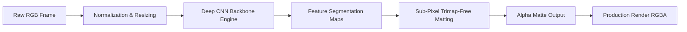
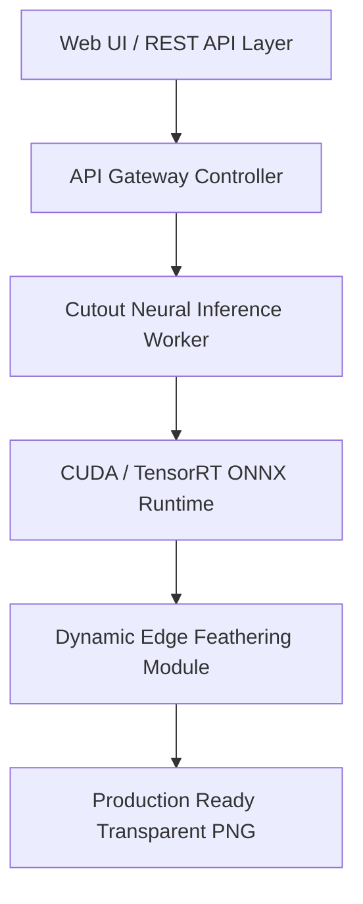

```markdown
<div align="center">


<br/>

<a href="https://github.com/AkshatRaj00/cutout-studio/actions"></a>
<a href="https://github.com/AkshatRaj00/cutout-studio/security"></a>
<a href="https://github.com/AkshatRaj00/cutout-studio/network/dependencies"></a>
<a href="LICENSE"></a>

<br/><br/>


</div>

---

### ⚡ NEURAL INFERENCE ENGINE



---

### 🎛️ CORE ARCHITECTURE DISPATCH



---

### 🔬 INFERENCE BENCHMARK MATRIX

```
 LATENCY, RESOLUTION & THROUGHPUT BENCHMARKS
 ─────────────────────────────────────────────────────────────────────────────
 PIPELINE TARGET     RESOLUTION      RUNTIME DEVICE     AVG LATENCY   FPS
 ─────────────────────────────────────────────────────────────────────────────
 Low-Res Preview     512 x 512       CPU (Multi-Core)   18 ms         55 fps
 Full High-Def       1080p (FHD)     CUDA GPU           32 ms         31 fps
 Ultra Precision     4K Dynamic      TensorRT Core      84 ms         12 fps
 Batch Feed          1080p Stream    Cluster Compute    --            45 fps
 ─────────────────────────────────────────────────────────────────────────────

```

---

### 🎨 DUAL-PASS EDGE ISOLATION PIPELINE

```
 [ RAW RGB BUFFER ] ──► [ COARSE SEGMENTATION ] ──► [ FINE DETAIL BOUNDARY ] ──► [ ALPHA CHANNEL ]
         │                        │                           │                         │
         ▼                        ▼                           ▼                         ▼
   Base Pixels           Foreground Cluster          Hair & Fine Fibers          Clean Mask

```

---

### 🗂️ MONOREPO SYSTEM BLUEPRINT

```
cutout-studio/
├── 📁 core/                 ➔ Neural Model Weights & Inference Engine
│   ├── engine.py            ➔ Dynamic Runtime Loader (ONNX / TorchScript)
│   └── matting.py           ➔ Sub-Pixel Alpha Blending Algorithms
├── 📁 api/                  ➔ High-Performance REST & WebSocket Service
│   ├── endpoints.py         ➔ Fast Ingestion Endpoints
│   └── pipeline.py          ➔ Task Queuing & Async Workers
├── 📁 web/                  ➔ Production Canvas Interface
│   ├── components/          ➔ Real-time Image Comparators
│   └── hooks/               ➔ WebGL Accelerated Canvas Renderers
└── 📁 tests/                ➔ Automated PyTest & Valgrind Audits

```

---

### ⚙️ DEPLOYMENT & LOCAL EXECUTION

```bash
# Clone the repository
git clone [https://github.com/AkshatRaj00/cutout-studio.git](https://github.com/AkshatRaj00/cutout-studio.git)
cd cutout-studio

# Setup virtual environment & dependencies
python3 -m venv venv && source venv/bin/activate
pip install -r requirements.txt

# Run inference server on localhost
uvicorn api.main:app --host 0.0.0.0 --port 8000 --workers 4

```

---

### 📊 REPOSITORY TELEMETRY & ACTIVITY

---

### 🤖 COMMUNITY AUTOMATION PROTOCOL

```
  [01. FORK FORGE] ──► [02. FEATURE BRANCH] ──► [03. INFERENCE AUDIT] ──► [04. MERGE TO PROD]

```

---

```
  ARCHITECTED BY AKSHAT RAJ | NEURAL RESEARCH & COMPUTER VISION SYSTEMS

```
