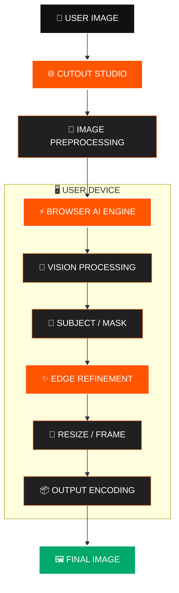
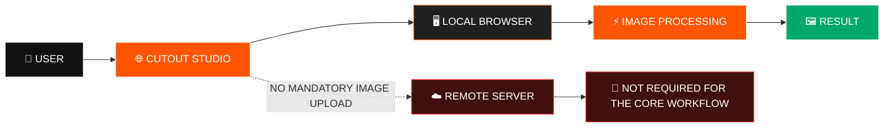
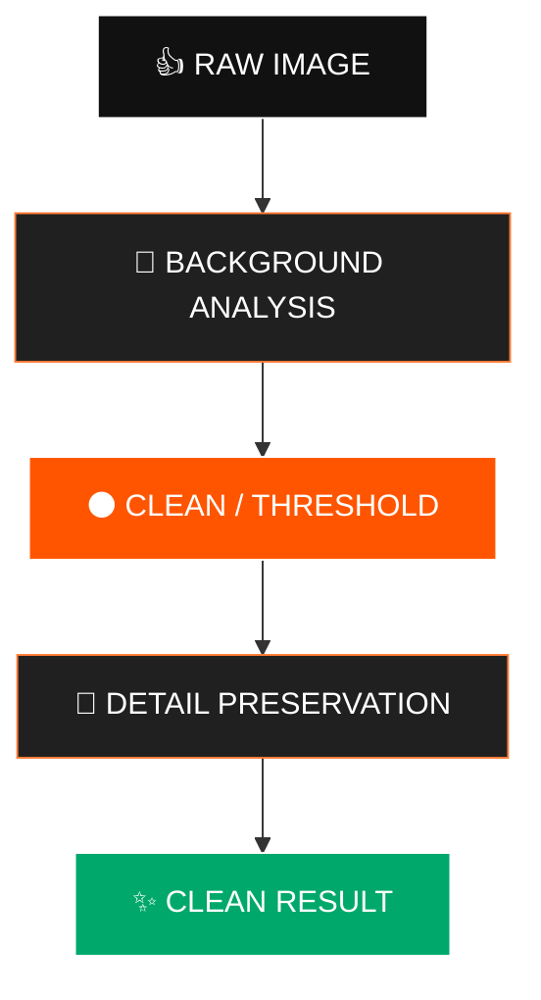
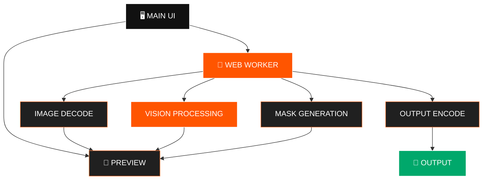
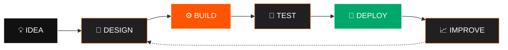

# ✂️ CUTOUT Studio

<div align="center">


### `ONEPERSONAI • COMPUTER VISION • CLIENT-SIDE AI`


<br/>

[](https://cutout.onepersonai.in/)
[](https://github.com/AkshatRaj00/cutout-studio)
[](LICENSE)
[](https://nextjs.org/)

<br/>

**AI-powered image processing directly inside your browser.**

</div>

---

# 🧬 What is CUTOUT Studio?

**CUTOUT Studio** is a privacy-first browser-based image processing platform built by **Akshat Raj / OnePersonAI**.

It is designed around a **client-side processing model**, allowing supported image-processing workflows to run directly in the user's browser.

### Built for

- 🪪 Exam & application photographs
- 👍 Left Thumb Impressions
- ✍️ Signatures
- 🖼️ Transparent PNG cutouts
- 🎨 Creator assets
- 📸 High-resolution image preparation

---

# ⚡ Core Architecture


```mermaid
flowchart TD

    A["📸 USER IMAGE"] --> B["🌐 CUTOUT STUDIO"]

    B --> C["🧹 IMAGE PREPROCESSING"]

    C --> D["⚡ BROWSER AI ENGINE"]

    subgraph LOCAL["🖥️ USER DEVICE"]

        D --> E["🧠 VISION PROCESSING"]
        E --> F["🎯 SUBJECT / MASK"]
        F --> G["✨ EDGE REFINEMENT"]
        G --> H["📐 RESIZE / FRAME"]
        H --> I["📦 OUTPUT ENCODING"]

    end

    I --> J["🖼️ FINAL IMAGE"]

    style A fill:#111111,stroke:#ffffff,color:#ffffff
    style B fill:#ff5500,stroke:#ffffff,stroke-width:3px,color:#ffffff
    style C fill:#202020,stroke:#ff7a35,color:#ffffff
    style D fill:#ff5500,stroke:#ffffff,stroke-width:3px,color:#ffffff
    style E fill:#202020,stroke:#ff7a35,color:#ffffff
    style F fill:#202020,stroke:#ff7a35,color:#ffffff
    style G fill:#ff5500,stroke:#ffffff,color:#ffffff
    style H fill:#202020,stroke:#ff7a35,color:#ffffff
    style I fill:#202020,stroke:#ff7a35,color:#ffffff
    style J fill:#00a86b,stroke:#ffffff,stroke-width:3px,color:#ffffff
```

---

# 🔥 Privacy-First Processing


```mermaid
flowchart LR

    A["👤 USER"] --> B["🌐 CUTOUT STUDIO"]
    B --> C["🖥️ LOCAL BROWSER"]
    C --> D["⚡ IMAGE PROCESSING"]
    D --> E["🖼️ RESULT"]

    B -. "NO MANDATORY IMAGE UPLOAD" .-> X["☁️ REMOTE SERVER"]
    X --> Y["🚫 NOT REQUIRED FOR THE CORE WORKFLOW"]

    style A fill:#111111,stroke:#ffffff,color:#ffffff
    style B fill:#ff5500,stroke:#ffffff,color:#ffffff
    style C fill:#202020,stroke:#ff7a35,color:#ffffff
    style D fill:#ff5500,stroke:#ffffff,color:#ffffff
    style E fill:#00a86b,stroke:#ffffff,color:#ffffff
    style X fill:#401010,stroke:#ff3333,color:#ffffff
    style Y fill:#401010,stroke:#ff3333,color:#ffffff
```

### Processing Model

```text
IMAGE
  │
  ▼
┌─────────────────────────────────────┐
│          USER'S BROWSER             │
│                                     │
│ Decode → Process → Refine → Export  │
│                                     │
└─────────────────────────────────────┘
  │
  ▼
LOCAL RESULT
```

---

# 🎯 One Engine • Multiple Workflows


```mermaid
flowchart TD

    A["✂️ CUTOUT STUDIO"] --> B["🎨 CREATOR"]
    A --> C["🪪 EXAM PHOTO"]
    A --> D["👍 THUMB IMPRESSION"]
    A --> E["✍️ SIGNATURE"]

    B --> B1["Transparent PNG"]
    B --> B2["High Resolution"]
    B --> B3["Clean Edges"]

    C --> C1["Auto Framing"]
    C --> C2["Dimension Control"]
    C --> C3["File Size Optimization"]

    D --> D1["Background Cleanup"]
    D --> D2["Contrast Enhancement"]
    D --> D3["Ridge Preservation"]

    E --> E1["Ink Isolation"]
    E --> E2["Background Cleanup"]
    E --> E3["Transparent Output"]

    style A fill:#ff5500,stroke:#ffffff,stroke-width:3px,color:#ffffff

    style B fill:#202020,stroke:#ff7a35,color:#ffffff
    style C fill:#202020,stroke:#ff7a35,color:#ffffff
    style D fill:#202020,stroke:#ff7a35,color:#ffffff
    style E fill:#202020,stroke:#ff7a35,color:#ffffff

    style B1 fill:#111111,stroke:#ff5500,color:#ffffff
    style B2 fill:#111111,stroke:#ff5500,color:#ffffff
    style B3 fill:#111111,stroke:#ff5500,color:#ffffff

    style C1 fill:#111111,stroke:#ff5500,color:#ffffff
    style C2 fill:#111111,stroke:#ff5500,color:#ffffff
    style C3 fill:#111111,stroke:#ff5500,color:#ffffff

    style D1 fill:#111111,stroke:#ff5500,color:#ffffff
    style D2 fill:#111111,stroke:#ff5500,color:#ffffff
    style D3 fill:#111111,stroke:#ff5500,color:#ffffff

    style E1 fill:#111111,stroke:#ff5500,color:#ffffff
    style E2 fill:#111111,stroke:#ff5500,color:#ffffff
    style E3 fill:#111111,stroke:#ff5500,color:#ffffff
```

---

# 🧪 Image Processing Pipeline


```mermaid
flowchart LR

    A["RAW IMAGE"] --> B["NORMALIZE"]
    B --> C["VISION INFERENCE"]
    C --> D["FOREGROUND MASK"]
    D --> E["ALPHA / TRANSPARENCY"]
    E --> F["EDGE REFINEMENT"]
    F --> G["OUTPUT"]

    style A fill:#111111,stroke:#888888,color:#ffffff
    style B fill:#202020,stroke:#ff7a35,color:#ffffff
    style C fill:#ff5500,stroke:#ffffff,color:#ffffff
    style D fill:#202020,stroke:#ff7a35,color:#ffffff
    style E fill:#ff5500,stroke:#ffffff,color:#ffffff
    style F fill:#202020,stroke:#ff7a35,color:#ffffff
    style G fill:#00a86b,stroke:#ffffff,color:#ffffff
```

---

# 🪪 Exam Photo Workflow


```mermaid
flowchart LR

    A["📷 ORIGINAL"] --> B["📐 FRAME"]
    B --> C["🖼️ RESIZE"]
    C --> D["⚙️ ENCODE"]
    D --> E["📦 SIZE CHECK"]
    E --> F["✅ READY"]

    style A fill:#111111,stroke:#ffffff,color:#ffffff
    style B fill:#202020,stroke:#ff7a35,color:#ffffff
    style C fill:#202020,stroke:#ff7a35,color:#ffffff
    style D fill:#ff5500,stroke:#ffffff,color:#ffffff
    style E fill:#202020,stroke:#ff7a35,color:#ffffff
    style F fill:#00a86b,stroke:#ffffff,color:#ffffff
```

Useful for image workflows where **dimensions, resolution and file size** matter.

> Always verify the current image requirements of the specific application portal before submission.

---

# 👍 Left Thumb Impression


```mermaid
flowchart TD

    A["👍 RAW IMAGE"] --> B["🧹 BACKGROUND ANALYSIS"]
    B --> C["⚫ CLEAN / THRESHOLD"]
    C --> D["🔎 DETAIL PRESERVATION"]
    D --> E["✨ CLEAN RESULT"]

    style A fill:#111111,stroke:#ffffff,color:#ffffff
    style B fill:#202020,stroke:#ff7a35,color:#ffffff
    style C fill:#ff5500,stroke:#ffffff,color:#ffffff
    style D fill:#202020,stroke:#ff7a35,color:#ffffff
    style E fill:#00a86b,stroke:#ffffff,color:#ffffff
```

---

# ✍️ Signature Processing

```text
              ORIGINAL IMAGE
                    │
                    ▼
          ┌──────────────────┐
          │    BACKGROUND    │
          │     ANALYSIS     │
          └────────┬─────────┘
                   │
                   ▼
          ┌──────────────────┐
          │  INK / CONTRAST  │
          │    ISOLATION     │
          └────────┬─────────┘
                   │
                   ▼
          ┌──────────────────┐
          │   TRANSPARENT    │
          │      OUTPUT      │
          └──────────────────┘
```

---

# ⚙️ Performance Architecture


```mermaid
flowchart TD

    UI["🖥️ MAIN UI"] --> W["🧵 WEB WORKER"]

    W --> P1["IMAGE DECODE"]
    W --> P2["VISION PROCESSING"]
    W --> P3["MASK GENERATION"]
    W --> P4["OUTPUT ENCODE"]

    UI --> C["🎨 PREVIEW"]

    P1 --> C
    P2 --> C
    P3 --> C
    P4 --> O["💾 OUTPUT"]

    style UI fill:#111111,stroke:#ffffff,color:#ffffff
    style W fill:#ff5500,stroke:#ffffff,color:#ffffff
    style C fill:#202020,stroke:#ff7a35,color:#ffffff
    style P1 fill:#202020,stroke:#ff7a35,color:#ffffff
    style P2 fill:#ff5500,stroke:#ffffff,color:#ffffff
    style P3 fill:#202020,stroke:#ff7a35,color:#ffffff
    style P4 fill:#202020,stroke:#ff7a35,color:#ffffff
    style O fill:#00a86b,stroke:#ffffff,color:#ffffff
```

---

# 🧰 Technology Stack

| Layer | Technology |
|---|---|
| 🎨 Frontend | Next.js • React • TypeScript |
| 🎨 UI | Tailwind CSS |
| 🧠 Computer Vision | Transformers.js / Browser Vision |
| ⚡ Processing | Web Workers |
| 🖼️ Image Engine | Canvas / Image Processing |
| 🌐 Architecture | Client-Side Web Application |
| 🔎 SEO | Metadata • Schema • Structured Data |

---

# 📁 Project Structure

```text
cutout-studio/
│
├── app/
│   ├── layout.tsx
│   ├── page.tsx
│   ├── lti/
│   └── signature/
│
├── public/
│   └── workers/
│
├── lib/
├── components/
│
├── package.json
├── next.config.mjs
├── tsconfig.json
├── tailwind.config.*
└── README.md
```

---

# 🔥 Feature Matrix

| Feature | Status |
|---|:---:|
| Client-Side Processing | ✅ |
| Browser-Based Workflow | ✅ |
| AI Background Removal | ✅ |
| Transparent PNG | ✅ |
| High-Resolution Workflow | ✅ |
| Exam Photo Preparation | ✅ |
| LTI Workflow | ✅ |
| Signature Workflow | ✅ |
| Web Worker Architecture | ✅ |
| Next.js | ✅ |
| TypeScript | ✅ |
| Tailwind CSS | ✅ |

---

# 🆚 CUTOUT Studio Model

```text
TRADITIONAL CLOUD WORKFLOW

IMAGE
  │
  ▼
UPLOAD
  │
  ▼
REMOTE SERVER
  │
  ▼
PROCESSING
  │
  ▼
DOWNLOAD
  │
  ▼
RESULT


CUTOUT STUDIO

IMAGE
  │
  ▼
USER BROWSER
  │
  ├── AI / VISION
  ├── PROCESSING
  ├── REFINEMENT
  └── EXPORT
  │
  ▼
RESULT
```

---

# 🚀 Run Locally

```bash
git clone https://github.com/AkshatRaj00/cutout-studio.git

cd cutout-studio

npm install

npm run dev
```

Open:

```text
http://localhost:3000
```

---

# 🧭 Development Flow


```mermaid
flowchart LR

    A["💡 IDEA"] --> B["🎨 DESIGN"]
    B --> C["⚙️ BUILD"]
    C --> D["🧪 TEST"]
    D --> E["🚀 DEPLOY"]
    E --> F["📈 IMPROVE"]

    F -.-> B

    style A fill:#111111,stroke:#ffffff,color:#ffffff
    style B fill:#202020,stroke:#ff7a35,color:#ffffff
    style C fill:#ff5500,stroke:#ffffff,color:#ffffff
    style D fill:#202020,stroke:#ff7a35,color:#ffffff
    style E fill:#00a86b,stroke:#ffffff,color:#ffffff
    style F fill:#202020,stroke:#ff7a35,color:#ffffff
```

---

# 🖼️ Product Preview

<div align="center">


<br/><br/>


<br/><br/>


</div>

---

# 🌐 Live Studio

<div align="center">

<a href="https://cutout.onepersonai.in/">


</a>

<br/><br/>

### `UPLOAD → PROCESS → REFINE → EXPORT`

**Privacy-first image processing powered by OnePersonAI.**

</div>

---

# 👨‍💻 Built By

<div align="center">


### **Akshat Raj**

`Founder & Engineer — OnePersonAI`

**Computer Vision • AI Engineering • Privacy-First Web Applications**

</div>

---

# 📜 License

This project is released under the **MIT License**.

See [`LICENSE`](LICENSE) for details.

---

<div align="center">

### ✂️ CUTOUT STUDIO

**Privacy-first image processing.**  
**Built in the browser.**  
**Designed for real workflows.**

<br/>

`ONEPERSONAI © AKSHAT RAJ`

</div>
